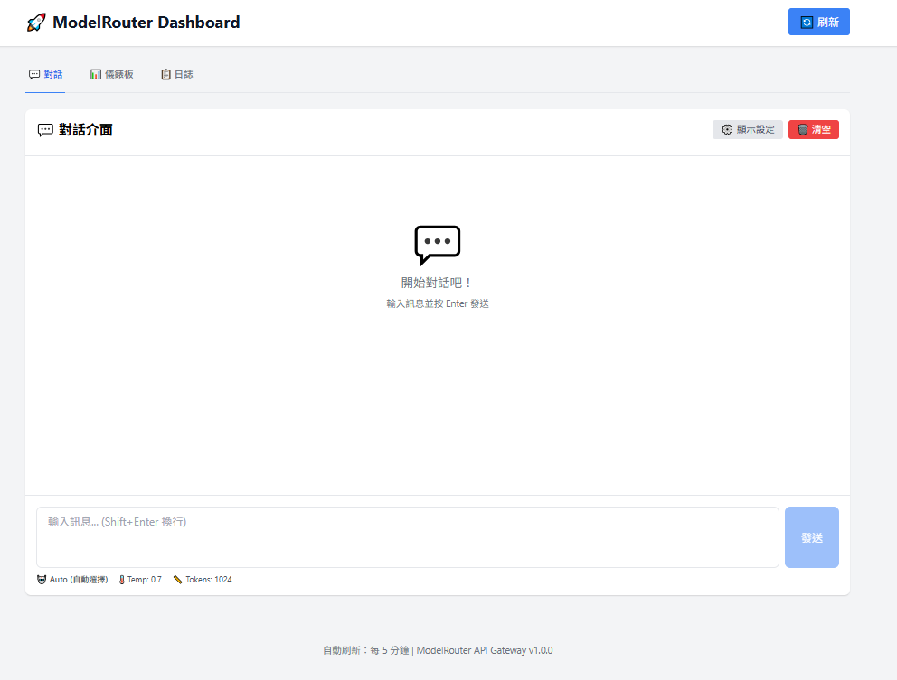
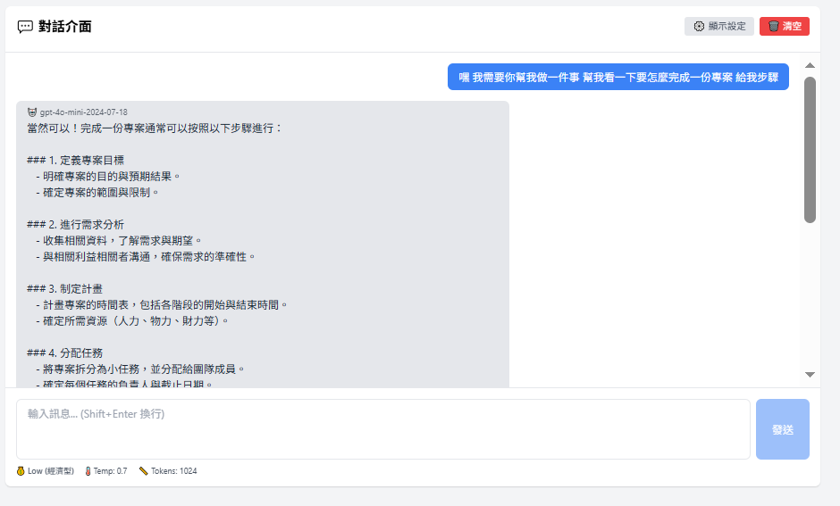
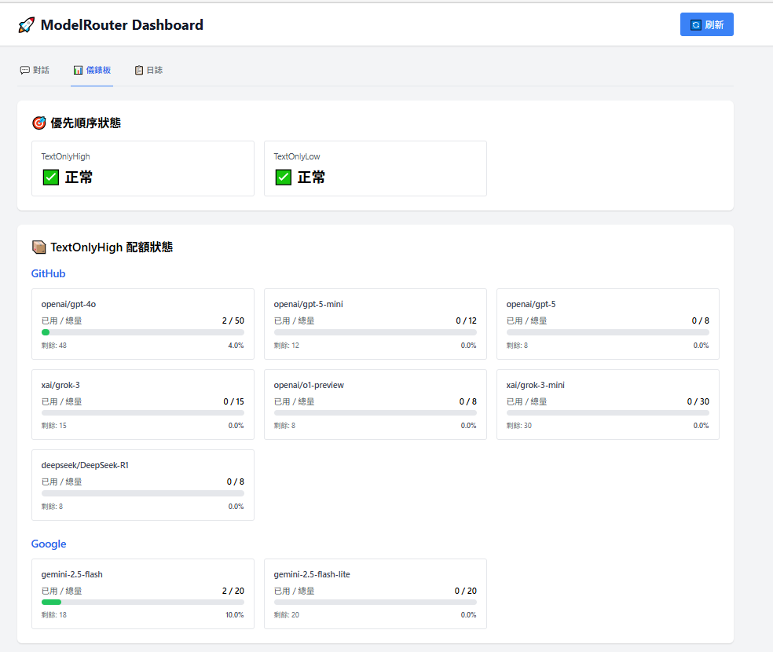
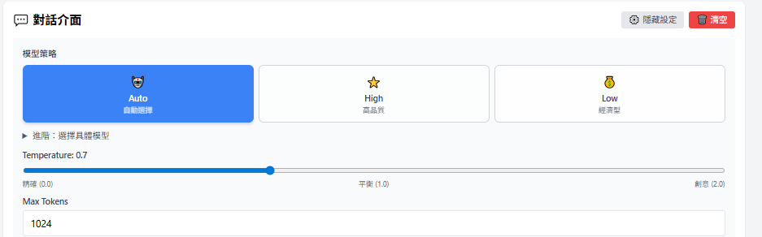
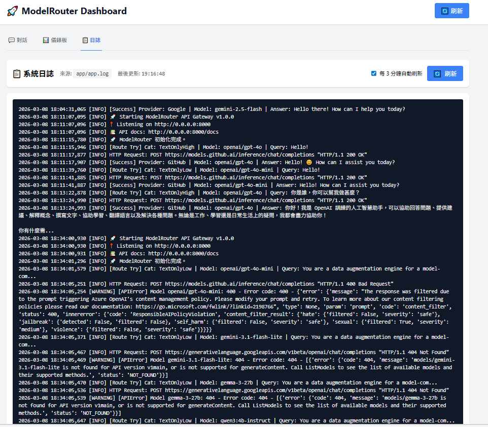

# ModelRouter API Gateway

多模型智慧路由 API 閘道，對外提供 OpenAI 相容介面，自動在 GitHub Models、Google Gemini、Ollama 之間做 failover 和配額管理。

## 功能特色

✅ **多提供者路由** - 自動在 GitHub Models、Google Gemini、Ollama 切換

✅ **智慧 Failover** - 一個模型失敗或額度滿，自動切換下一個

✅ **配額管理** - 本地追蹤每個模型的每日請求數 (RPD)

✅ **OpenAI 相容** - 完全相容 OpenAI API 格式

✅ **智慧記憶功能** - Pre-chat 分析，自動查詢歷史日誌（使用 gemma-3-27b-it）⭐ NEW

✅ **Web UI** - React 前端儀錶板，實時查看配額和對話

✅ **自動文檔** - FastAPI 自動生成 API 文檔

## 📸 功能展示

### Web UI 介面預覽

#### 💬 對話介面
即時與 AI 對話。



#### 🤖 AI 回應展示
查看 AI 的詳細回應和對話內容。



#### 📊 配額儀錶板
即時監控各模型的使用情況和配額狀態。



#### 🔄 智慧切換
自動在不同 AI 提供者之間切換，確保服務持續可用。



#### 📝 日誌檢視器
查看系統運行日誌和 API 呼叫記錄。



## 快速開始

### 1. 設定環境變數

創建 `.env` 檔案：

```bash
# Google Gemini API Key
GOOGLE_API_KEY=your_google_api_key

# GitHub Models API Key (可選)
GITHUB_MODELS_API_KEY=your_github_token

# API 服務配置
API_HOST=0.0.0.0
API_PORT=8000
```

### 2. 安裝依賴

```bash
pip install fastapi uvicorn openai python-dotenv pydantic
```

### 3. 啟動後端 API

```bash
python api.py
```

服務將在以下地址啟動：
- **API 服務**: http://0.0.0.0:8000
- **API 文檔**: http://localhost:8000/docs
- **健康檢查**: http://localhost:8000/health

### 4. 啟動前端 (可選)

```bash
./start_frontend.sh
```

前端將在 http://localhost:3000 啟動

詳細說明請參考 [FRONTEND_GUIDE.md](FRONTEND_GUIDE.md)

## API 端點

### 核心接口

| 端點 | 方法 | 說明 |
|------|------|------|
| `/v1/chat/completions` | POST | OpenAI Chat Completions API |
| `/v1/completions` | POST | OpenAI Completions API (legacy) |
| `/v1/models` | GET/POST | 列出所有可用模型 |
| `/health` | GET/POST | 健康檢查 |
| `/` | GET/POST | 服務資訊 |

### 管理接口

| 端點 | 方法 | 說明 |
|------|------|------|
| `/admin/status` | GET | 查看配額狀態 |
| `/admin/reset_quotas` | POST | 重置所有配額 (每日) |
| `/admin/refresh_rpm` | POST | 重置優先順序指標 |

## 使用範例

### Python (OpenAI SDK)

```python
from openai import OpenAI

client = OpenAI(
    base_url="http://localhost:8000/v1",
    api_key="dummy"  # ModelRouter 不需要驗證，可填任意值
)

response = client.chat.completions.create(
    model="auto",  # 自動選擇最佳模型
    messages=[
        {"role": "user", "content": "Hello!"}
    ]
)

print(response.choices[0].message.content)
```

### cURL

```bash
curl -X POST http://localhost:8000/v1/chat/completions \
  -H "Content-Type: application/json" \
  -d '{
    "model": "auto",
    "messages": [{"role": "user", "content": "Hello!"}]
  }'
```

### 查看配額狀態

```bash
curl http://localhost:8000/admin/status
```

### 直接 API 呼叫格式

您可以直接透過 HTTP POST 請求與 API 互動，無需安裝任何 SDK：

#### 基本請求格式

```bash
POST http://localhost:8000/v1/chat/completions
Content-Type: application/json

{
  "model": "auto",
  "messages": [
    {"role": "system", "content": "你是一個有幫助的助手"},
    {"role": "user", "content": "你好"}
  ]
}
```

#### 完整參數範例

```bash
curl -X POST http://localhost:8000/v1/chat/completions \
  -H "Content-Type: application/json" \
  -H "Authorization: Bearer dummy" \
  -d '{
    "model": "auto",
    "messages": [
      {"role": "system", "content": "你是一個專業的程式設計助手"},
      {"role": "user", "content": "用 Python 寫一個 Hello World"}
    ],
    "temperature": 0.7,
    "max_tokens": 1000,
    "top_p": 1.0,
    "frequency_penalty": 0.0,
    "presence_penalty": 0.0
  }'
```

#### 多輪對話範例

```bash
curl -X POST http://localhost:8000/v1/chat/completions \
  -H "Content-Type: application/json" \
  -d '{
    "model": "TextOnlyHigh",
    "messages": [
      {"role": "user", "content": "什麼是機器學習？"},
      {"role": "assistant", "content": "機器學習是人工智慧的一個分支..."},
      {"role": "user", "content": "可以舉例說明嗎？"}
    ]
  }'
```

#### 使用不同程式語言直接呼叫

**JavaScript/Node.js (Fetch API):**
```javascript
const response = await fetch('http://localhost:8000/v1/chat/completions', {
  method: 'POST',
  headers: {
    'Content-Type': 'application/json',
  },
  body: JSON.stringify({
    model: 'auto',
    messages: [
      { role: 'user', content: '你好，請介紹自己' }
    ],
    temperature: 0.7,
    max_tokens: 500
  })
});

const data = await response.json();
console.log(data.choices[0].message.content);
```

**Python (requests):**
```python
import requests

response = requests.post(
    'http://localhost:8000/v1/chat/completions',
    headers={'Content-Type': 'application/json'},
    json={
        'model': 'auto',
        'messages': [
            {'role': 'user', 'content': '用 Python 計算階乘'}
        ],
        'temperature': 0.7,
        'max_tokens': 1000
    }
)

result = response.json()
print(result['choices'][0]['message']['content'])
```

**PHP:**
```php
<?php
$data = [
    'model' => 'auto',
    'messages' => [
        ['role' => 'user', 'content' => 'Hello from PHP!']
    ]
];

$options = [
    'http' => [
        'method' => 'POST',
        'header' => 'Content-Type: application/json',
        'content' => json_encode($data)
    ]
];

$context = stream_context_create($options);
$response = file_get_contents('http://localhost:8000/v1/chat/completions', false, $context);
$result = json_decode($response, true);

echo $result['choices'][0]['message']['content'];
?>
```

**Java (HttpClient):**
```java
import java.net.http.*;
import java.net.URI;

HttpClient client = HttpClient.newHttpClient();

String json = """
{
  "model": "auto",
  "messages": [{"role": "user", "content": "Hello from Java!"}]
}
""";

HttpRequest request = HttpRequest.newBuilder()
    .uri(URI.create("http://localhost:8000/v1/chat/completions"))
    .header("Content-Type", "application/json")
    .POST(HttpRequest.BodyPublishers.ofString(json))
    .build();

HttpResponse<String> response = client.send(request, 
    HttpResponse.BodyHandlers.ofString());

System.out.println(response.body());
```

#### 回應格式

成功的回應格式 (OpenAI 相容):

```json
{
  "id": "chatcmpl-abc123",
  "object": "chat.completion",
  "created": 1709856000,
  "model": "gemini-2.5-flash",
  "choices": [
    {
      "index": 0,
      "message": {
        "role": "assistant",
        "content": "你好！我是 AI 助手，很高興為您服務。"
      },
      "finish_reason": "stop"
    }
  ],
  "usage": {
    "prompt_tokens": 10,
    "completion_tokens": 15,
    "total_tokens": 25
  }
}
```

錯誤回應格式:

```json
{
  "error": {
    "message": "所有模型都不可用或已達配額上限",
    "type": "unavailable_error",
    "code": 503
  }
}
```

#### 遠端伺服器呼叫

如果 API 部署在遠端伺服器，將 `localhost` 替換為伺服器 IP 或網域名稱：

```bash
# 使用 IP 位址
curl -X POST http://192.168.1.100:8000/v1/chat/completions \
  -H "Content-Type: application/json" \
  -d '{"model": "auto", "messages": [{"role": "user", "content": "Hello"}]}'

# 使用網域名稱
curl -X POST https://api.yourdomain.com/v1/chat/completions \
  -H "Content-Type: application/json" \
  -d '{"model": "auto", "messages": [{"role": "user", "content": "Hello"}]}'
```

#### 支援的參數

| 參數 | 類型 | 必填 | 說明 |
|------|------|------|------|
| `model` | string | 是 | 模型名稱 (`auto`, `TextOnlyHigh`, `TextOnlyLow` 或具體模型) |
| `messages` | array | 是 | 對話訊息陣列 |
| `temperature` | float | 否 | 控制隨機性 (0.0-2.0)，預設 1.0 |
| `max_tokens` | integer | 否 | 最大生成 tokens 數，預設模型限制 |
| `top_p` | float | 否 | Nucleus sampling (0.0-1.0)，預設 1.0 |
| `frequency_penalty` | float | 否 | 頻率懲罰 (-2.0-2.0)，預設 0.0 |
| `presence_penalty` | float | 否 | 存在懲罰 (-2.0-2.0)，預設 0.0 |
| `stop` | string/array | 否 | 停止序列 |
| `stream` | boolean | 否 | 是否串流回應（目前不支援） |

## 🎯 模型選擇

`model` 參數支援：

- `auto` - 自動選擇（先 TextOnlyHigh，再 TextOnlyLow）
- `TextOnlyHigh` - 只用高品質模型（GitHub gpt-4o, Gemini 2.5 flash）
- `TextOnlyLow` - 只用經濟型模型（GitHub gpt-4o-mini, Gemini 3.1 flash-lite, Ollama 本地模型）
- 具體模型名稱 - 如 `openai/gpt-4o`、`gemini-2.5-flash`

## 🧠 智慧記憶功能 ⭐ NEW

ModelRouter 現在支援智慧記憶功能，可以自動判斷是否需要查詢歷史日誌：

### 功能特點

- **Pre-chat 分析**：使用 gemma-3-27b-it 判斷用戶問題是否需要查詢歷史
- **自動 RAG**：檢測到記憶相關關鍵字時，自動讀取 app.log 並增強 prompt
- **配額追蹤**：gemma-3-27b-it 的使用會正確計入配額管理系統
- **對話歷史**：自動保存最近 10 輪對話

### 工作流程

```
用戶輸入
    ↓
檢查關鍵字
    ↓
Pre-chat 分析 (gemma-3-27b-it)
    ├─ 檢查配額是否足夠 ⭐
    ├─ 調用模型
    └─ 成功後扣減配額 ⭐
    ↓
需要查 log？
    ├─ 否 → 正常處理
    └─ 是 → 讀取 app.log
            ↓
         增強 prompt
            ↓
         發送到主模型
            ↓
         返回結果
            ↓
         保存到對話歷史
```

### 觸發關鍵字

當用戶問題包含以下關鍵字時，會觸發記憶查詢：

**中文**：記憶、查看過去、剛剛、之前、先前、上次、日誌、歷史、記錄

**英文**：memory、log、history

### 使用範例

```python
# 一般對話（不觸發記憶）
response = client.chat.completions.create(
    model="auto",
    messages=[{"role": "user", "content": "你好，介紹一下你自己"}]
)

# 查詢歷史（觸發記憶，會自動查詢 app.log）
response = client.chat.completions.create(
    model="auto",
    messages=[{"role": "user", "content": "請查看剛剛的記錄"}]
)
```

### 配額管理機制

Pre-chat 分析採用**兩層配額管理機制**：

**第一層：gemma-3-27b-it（主要）**
- 使用 gemma-3-27b-it 模型進行智能判斷
- 調用前檢查配額，確保配額足夠才調用
- 調用成功後自動扣減配額（計數跳動）⭐
- 配額設定：14400 RPD（每日請求數）

**第二層：關鍵字匹配（備用）**
- 如果 gemma-3-27b-it 配額用完，自動降級為關鍵字匹配
- 完全本地處理，不依賴外部 API
- 保證功能不會完全失效

### 查看配額狀態

```bash
# 查看所有模型配額（包含 gemma-3-27b-it）
curl http://localhost:8000/admin/status

# 重置配額（每日一次）
curl -X POST http://localhost:8000/admin/reset_quotas

# 查看即時日誌
tail -f app/app.log | grep -E '\[Pre-chat\]|\[Memory\]'
```

### 技術細節

ModelRouter 新增的方法：

- **`add_to_history(user_message, assistant_response)`** - 將對話添加到歷史記錄
- **`check_need_log_rag(user_message)`** - Pre-chat 分析，自動管理配額
- **`read_app_log(max_lines=100)`** - 讀取 app.log 的最後 N 行

配置參數：
- `max_history_size`: 最多保留的對話輪數（默認 10）
- `max_lines`: 讀取 log 的最大行數（默認 100）

## 專案結構

```
llm-api/
├── api.py                     # 主 API 服務
├── ModelRouter/               # 路由引擎
│   ├── ModelRouter.py         # 核心路由邏輯
│   └── models.py              # 模型配置
├── frontend/                  # React 前端
│   ├── src/
│   │   ├── components/        # UI 組件
│   │   └── App.jsx            # 主應用
│   └── package.json
├── .env                       # 環境變數配置
├── start_frontend.sh          # 前端啟動腳本
└── README.md                  # 本文件
```

## 配置說明

### 環境變數

在 `.env` 中配置：

```bash
# Google Gemini API
GOOGLE_API_KEY=your_google_api_key
GOOGLE_API_URL=https://generativelanguage.googleapis.com/v1beta/openai/

# GitHub Models (可選)
GITHUB_MODELS_API_KEY=your_github_personal_access_token
GITHUB_MODELS_API_URL=https://models.github.ai/inference

# Ollama (本地，可選)
OLLAMA_API_KEY=ollama
OLLAMA_API_URL=http://localhost:11434/v1

# API 服務
API_HOST=0.0.0.0
API_PORT=8000
```

### 模型優先順序

在 `ModelRouter/ModelRouter.py` 的 `_config_limits` 中配置：

- **TextOnlyHigh**: GitHub gpt-4o → Google gemini-2.5-flash
- **TextOnlyLow**: GitHub gpt-4o-mini → Google gemini-3.1-flash-lite → Ollama 本地模型

順序決定 failover 策略，額度滿或失敗會自動切換下一個。

## 常見問題

### 1. GitHub Models 403 錯誤

- 確認 `GITHUB_MODELS_API_KEY` 已設定（需要 GitHub PAT Token）
- 確認你的 GitHub 帳號有 Copilot 訂閱
- 部分模型需要 Copilot Pro/Enterprise

暫時解決：系統會自動 failover 到 Google Gemini

### 2. Google Gemini API Key

前往 https://aistudio.google.com/app/apikey 建立 API Key

### 3. 如何使用本地 Ollama 模型

```bash
# 1. 安裝 Ollama
curl -fsSL https://ollama.com/install.sh | sh

# 2. 下載模型
ollama pull qwen3:4b-instruct
ollama pull deepseek-r1:1.5b

# 3. 確保 Ollama 在背景運行
ollama serve
```

ModelRouter 會在高優先級模型額度用完後自動切換到 Ollama。

## Web UI 功能

前端提供：
- 💬 **對話介面** - 即時與 AI 對話
- 📊 **配額儀錶板** - 查看各模型使用情況
- ⚙️ **設定調整** - Temperature、Max Tokens、模型選擇
- 🔄 **自動刷新** - 每 5 分鐘更新配額

詳細說明請參考 [FRONTEND_GUIDE.md](FRONTEND_GUIDE.md)

## 授權

MIT License
